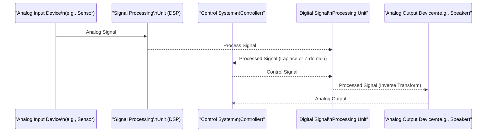

```mermaid
sequenceDiagram
  participant AnalogInput as "Analog Input Device\n(e.g., Sensor)"
  participant SignalProcessing as "Signal Processing\nUnit (DSP)"
  participant ControlSystem as "Control System\n(Controller)"
  participant DigitalProcessing as "Digital Signal\nProcessing Unit"
  participant AnalogOutput as "Analog Output Device\n(e.g., Speaker)"

  AnalogInput->>SignalProcessing: Analog Signal
  SignalProcessing-->>DigitalProcessing: Process Signal
  DigitalProcessing-->>ControlSystem: Processed Signal (Laplace or Z-domain)
  ControlSystem-->>DigitalProcessing: Control Signal
  DigitalProcessing-->>AnalogOutput: Processed Signal (Inverse Transform)
  AnalogOutput--x ControlSystem: Analog Output
```
